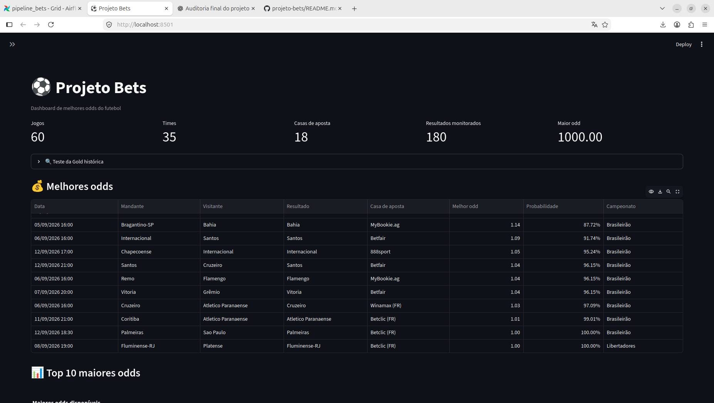

# ⚽ Projeto Bets — Pipeline de Engenharia de Dados

Pipeline de Engenharia de Dados desenvolvido para coleta, processamento, armazenamento e disponibilização de dados de odds esportivas.

O projeto foi desenvolvido com foco na aplicação prática de conceitos de **Engenharia de Dados**, construindo um fluxo automatizado desde a ingestão de dados de uma API até sua disponibilização para análise.

---

## 🏗️ Arquitetura

```text
                    ┌─────────────────┐
                    │  The Odds API   │
                    └────────┬────────┘
                             │
                             ▼
                    ┌─────────────────┐
                    │     BRONZE      │
                    │   Dados brutos  │
                    └────────┬────────┘
                             │
                             ▼
                    ┌─────────────────┐
                    │     SILVER      │
                    │     PySpark     │
                    │  Transformações │
                    └────────┬────────┘
                             │
                             ▼
                    ┌─────────────────┐
                    │      GOLD       │
                    │ Dados analíticos│
                    └────────┬────────┘
                             │
                             ▼
                    ┌─────────────────┐
                    │   PostgreSQL    │
                    │ Armazenamento   │
                    └────────┬────────┘
                             │
                             ▼
                    ┌─────────────────┐
                    │    Streamlit    │
                    │    Dashboard    │
                    └─────────────────┘

                    ▲

                    │
             ┌───────────────┐
             │ Apache Airflow│
             │  Orquestração │
             └───────────────┘
```

---

## 🎯 Objetivo

O objetivo do projeto é construir um pipeline capaz de coletar dados de odds esportivas, processá-los e disponibilizá-los de forma estruturada para análise.

O projeto foi desenvolvido como uma aplicação prática de conceitos fundamentais de Engenharia de Dados, incluindo:

* ingestão de dados através de APIs;
* processamento de dados;
* arquitetura em camadas;
* transformação e organização dos dados;
* orquestração de pipelines;
* armazenamento em banco de dados;
* automação;
* disponibilização de dados para análise.

---

## 🔄 Pipeline de dados

### 1. Ingestão — Bronze

Os dados são coletados através da **The Odds API**.

Os dados recebidos são armazenados inicialmente na camada Bronze, preservando a estrutura original da fonte.

Competições utilizadas no projeto:

* Campeonato Brasileiro;
* Copa Libertadores;
* Copa Sul-Americana.

---

### 2. Processamento — Silver

Os dados da camada Bronze são processados utilizando **Apache Spark / PySpark**.

Nesta etapa são realizadas transformações como:

* leitura dos dados brutos;
* expansão das estruturas de odds;
* normalização dos registros;
* organização dos eventos;
* tratamento dos dados;
* seleção das informações necessárias para as próximas etapas.

---

### 3. Camada analítica — Gold

Na camada Gold são gerados datasets preparados para consumo analítico.

Entre as informações disponibilizadas estão:

* partidas;
* times;
* casas de apostas;
* mercados;
* odds;
* horários das partidas;
* melhores odds encontradas;
* informações da competição.

Os dados processados são armazenados em formato **Parquet**.

---

## ⚙️ Orquestração com Apache Airflow

O **Apache Airflow** é utilizado para automatizar e orquestrar a execução do pipeline.

A DAG principal do projeto é responsável por organizar a sequência das etapas:

```text
Ingestão
   ↓
Bronze
   ↓
Silver
   ↓
Gold
```

O Airflow é executado em containers Docker utilizando `Docker Compose`.

A execução das tarefas é controlada pela DAG `pipeline_bets`.

---

## 🗄️ PostgreSQL

O projeto utiliza **PostgreSQL** como banco de dados para armazenamento e consulta das informações estruturadas.

O PostgreSQL também é utilizado pelo ambiente do Airflow como banco de metadados.

No ambiente local, o PostgreSQL disponibilizado pelo Docker utiliza a porta:

```text
5433
```

O banco utilizado pela aplicação é:

```text
projeto_bets
```

---

## 📊 Dashboard

Foi desenvolvido um dashboard utilizando **Streamlit** para disponibilizar os dados processados pelo pipeline.

O dashboard permite visualizar informações como:

* campeonatos;
* partidas;
* times;
* casas de apostas;
* melhores odds;
* histórico das odds;
* probabilidade implícita das odds.

### Visualização

O dashboard utiliza:

* **Streamlit** para a aplicação;
* **Pandas** para manipulação dos dados;
* **Plotly** para visualizações;
* **PostgreSQL** como fonte dos dados.

---

## 🖥️ Demonstração



## 🛠️ Tecnologias utilizadas

| Tecnologia     | Utilização                          |
| -------------- | ----------------------------------- |
| Python         | Desenvolvimento do pipeline         |
| PySpark        | Processamento e transformação       |
| Apache Spark   | Processamento de dados              |
| Apache Airflow | Orquestração                        |
| PostgreSQL     | Armazenamento e consulta            |
| Docker         | Containerização                     |
| Docker Compose | Gerenciamento dos serviços          |
| Streamlit      | Dashboard                           |
| Pandas         | Manipulação de dados                |
| Plotly         | Visualização                        |
| The Odds API   | Fonte de dados                      |
| Parquet        | Armazenamento dos dados processados |
| Git            | Versionamento                       |
| GitHub         | Hospedagem do código                |

---


## 📁 Estrutura do projeto

```text
projeto-bets/
│
├── airflow/
│   ├── dags/
│   │   └── pipeline_bets.py
│   ├── Dockerfile
│   ├── docker-compose.yml
│   └── plugins/
│
├── codigo-fonte/
│   ├── config/
│   │   ├── paths.py
│   │   └── setting.py
│   │
│   ├── ingestao/
│   │   └── coletar_odds.py
│   │
│   ├── processamento/
│   │   ├── silver.py
│   │   └── gold.py
│   │
│   └── utils/
│       └── logger.py
│
├── dashboard/
│   ├── app.py
│   └── utils/
│       └── carregar_dados.py
│
├── data/
│   ├── bronze/
│   ├── silver/
│   └── gold/
│
├── .gitignore
├── README.md
└── requirements.txt
```

> Os dados gerados pelo pipeline, logs do Airflow, ambientes virtuais e arquivos contendo credenciais não devem ser versionados no Git.

---

## 🔐 Variáveis de ambiente

As informações sensíveis são configuradas através de variáveis de ambiente.

Exemplo:

```env
ODDS_API_KEY=sua_chave_aqui

POSTGRES_USER=airflow
POSTGRES_PASSWORD=airflow
POSTGRES_HOST=localhost
POSTGRES_PORT=5433
POSTGRES_DB=projeto_bets
```

O arquivo `.env` está incluído no `.gitignore` e **não deve ser enviado ao GitHub**.

---

## 🚀 Como executar

### Pré-requisitos

Antes de executar o projeto, é necessário ter instalado:

* Python 3;
* Docker;
* Docker Compose;
* Git.

---

### 1. Clonar o repositório

```bash
git clone <URL_DO_REPOSITORIO>
cd projeto-bets
```

---

### 2. Criar o ambiente Python

```bash
python3 -m venv bets
source bets/bin/activate
```

---

### 3. Instalar as dependências

```bash
pip install -r requirements.txt
```

---

### 4. Configurar as variáveis de ambiente

Crie o arquivo:

```text
.env
```

e configure as variáveis necessárias, incluindo a chave da API.

O arquivo `.env` não deve ser enviado para o GitHub.

---

### 5. Iniciar o Airflow

Entre na pasta:

```bash
cd airflow
```

Execute:

```bash
docker compose up -d
```

O ambiente do Airflow possui:

* Webserver;
* Scheduler;
* PostgreSQL;
* Airflow Init.

O Webserver fica disponível na porta:

```text
8080
```

---

### 6. Executar o dashboard

Na pasta do dashboard:

```bash
cd dashboard
streamlit run app.py
```

O Streamlit disponibilizará a aplicação localmente.

---

## 📚 Conceitos de Engenharia de Dados aplicados

Durante o desenvolvimento do projeto foram aplicados conceitos como:

* ETL;
* ELT;
* ingestão de dados;
* APIs REST;
* Data Lake;
* arquitetura Bronze, Silver e Gold;
* processamento distribuído;
* Apache Spark;
* PySpark;
* Apache Airflow;
* pipelines automatizados;
* armazenamento em Parquet;
* bancos de dados relacionais;
* PostgreSQL;
* Docker;
* Git e GitHub;
* consumo de dados para análise.

---

## 🚧 Possíveis evoluções

O projeto pode ser evoluído futuramente com:

* testes automatizados;
* monitoramento do pipeline;
* alertas de falhas;
* expansão das fontes de dados;
* CI/CD;
* infraestrutura em cloud;
* utilização de serviços gerenciados de dados;
* melhoria da observabilidade do pipeline.

---

## 👨‍💻 Autor

**Lucas Galdino da Silva**

Estudante de Análise e Desenvolvimento de Sistemas com foco em **Engenharia de Dados**.

### Tecnologias de interesse

`Python` • `SQL` • `PySpark` • `Apache Airflow` • `PostgreSQL` • `Docker` • `Data Engineering`

---

## 📌 Observação

Este projeto foi desenvolvido com finalidade educacional e de portfólio, buscando aplicar na prática conceitos e ferramentas utilizadas em projetos de Engenharia de Dados.

O projeto não tem como objetivo fornecer recomendações de apostas.
